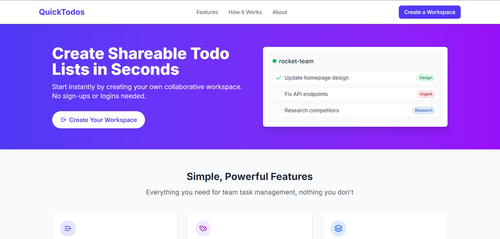

# QuickTodos – The Ultimate Collaborative Todo List App 🚀

Welcome to **QuickTodos**, the next level of task management! Whether you're managing personal to-do lists or collaborating with your team, QuickTodos is designed to make your workflow as simple, fast, and effective as possible. Say goodbye to cumbersome apps and hello to seamless task organization—anytime, anywhere, with anyone!

## 📱 See it in Action



## 🎯 Why QuickTodos?

QuickTodos is more than just a to-do list app. It's the perfect solution for teams and individuals who want to **organize, track, and share tasks effortlessly**. Whether you're working on a group project or keeping your personal tasks in check, QuickTodos gives you full control and flexibility with just a drag-and-drop system!

**Features at a Glance:**
- ✅ **Instant Collaboration:** Share your to-do list with anyone using a simple URL.
- ✅ **No Sign-Up Required:** Start managing tasks in seconds without creating an account.
- ✅ **Task Organization:** Group tasks by custom categories, set priority levels, and more.
- ✅ **Cloud-Powered:** Never worry about losing your tasks with cloud storage—accessible from any device.
- ✅ **Simple and Powerful Sorting:** Easily organize tasks by name, urgency, or manual order.

## 🚀 Live Demo

Experience the power of QuickTodos right now! 🖥️
[Check out the live demo here!](https://quicktodos-17a86.web.app)

---

## 📚 Getting Started - Clone & Run QuickTodos Locally

Want to try QuickTodos on your local machine or tweak it to your needs? Here's your ultimate guide to cloning and running the app!

### 1️⃣ Clone the Repository
First, get the project on your local machine by cloning the repository:

```bash
git clone https://github.com/NickDabizaz/QuickTodos.git
```

### 2️⃣ Install Dependencies
Once you've cloned the project, navigate to the project directory and install the required dependencies using either **npm** or **yarn**:

```bash
cd QuickTodos
npm install
# OR if you use yarn
yarn install
```

### 3️⃣ Setup Environment Variables
QuickTodos uses **Firebase** for backend services. To connect your app to Firebase, you need to set up the environment variables.

- Copy the example environment file to create a local environment setup:

```bash
cp .env.example .env.local
```

- Open `.env.local` and replace the Firebase configuration values with your own credentials from [Firebase Console](https://console.firebase.google.com/).

### 4️⃣ Running the Application
Now that everything is set up, you're ready to run the app! Start the development server with the following command:

```bash
npm run dev
# OR
yarn dev
```

Open [http://localhost:3000](http://localhost:3000) in your browser and voila! 🎉

---

## 🌟 Key Features of QuickTodos

QuickTodos is packed with essential features to supercharge your productivity:

- **Create and Share Todo Lists Instantly**: Perfect for teams and personal projects.
- **No Account Needed**: Just create, share, and get things done.
- **Customizable Categories**: Organize your tasks exactly how you want.
- **Priority Settings**: Mark tasks as **Urgent**, **Normal**, or **Low Priority**.
- **Drag-and-Drop Tasks**: Organize tasks quickly and easily.
- **Cloud Storage**: All your data is safely stored in the cloud, accessible across devices.
- **Fast Sorting Options**: Sort tasks by name, urgency, or in any manual order.

---

## 🔧 Technologies Behind QuickTodos

QuickTodos is built with modern technologies for a seamless user experience:

- **Frontend**: Built with **Next.js 14** and **React** for fast and dynamic UI.
- **Styling**: Elegant UI powered by **Tailwind CSS**.
- **Backend**: **Firebase Firestore** handles data storage and authentication.
- **Deployment**: Hosted on **Vercel** and **Firebase Hosting** for fast, reliable, and global access.

---

## 🌍 Deployment Options

QuickTodos is ready for deployment! You can either deploy to **Vercel** or **Firebase Hosting** with just a few clicks.

- **[Vercel](https://vercel.com/new)**: The easiest way to deploy your Next.js app.
- **[Firebase Hosting](https://firebase.google.com/docs/hosting)**: Perfect for Firebase-backed applications.

---

## 🚀 Want to Contribute?

We're always open to contributions! 🌱 If you find a bug or want to suggest new features, feel free to fork the repository and submit a pull request. Let's make QuickTodos even better together!

---

## 💬 Connect With Us

Got questions, feedback, or just want to chat about QuickTodos? We'd love to hear from you!

- **GitHub Repository**: [QuickTodos on GitHub](https://github.com/NickDabizaz/QuickTodos)
- **Live Demo**: [QuickTodos Live Demo](https://quicktodos-17a86.web.app)

---

## 🏆 Showcase Your Projects with QuickTodos

QuickTodos is a powerful tool for anyone looking to **stay organized** and **boost productivity**. Whether you're working solo or in a team, QuickTodos is here to help you **manage tasks** in a way that's **simple, efficient, and enjoyable**.

---

## ✨ Ready to Get Started?

Clone the repository, set up the environment, and start organizing your life—today! 🎉

[Click here to get started](https://github.com/NickDabizaz/QuickTodos)
